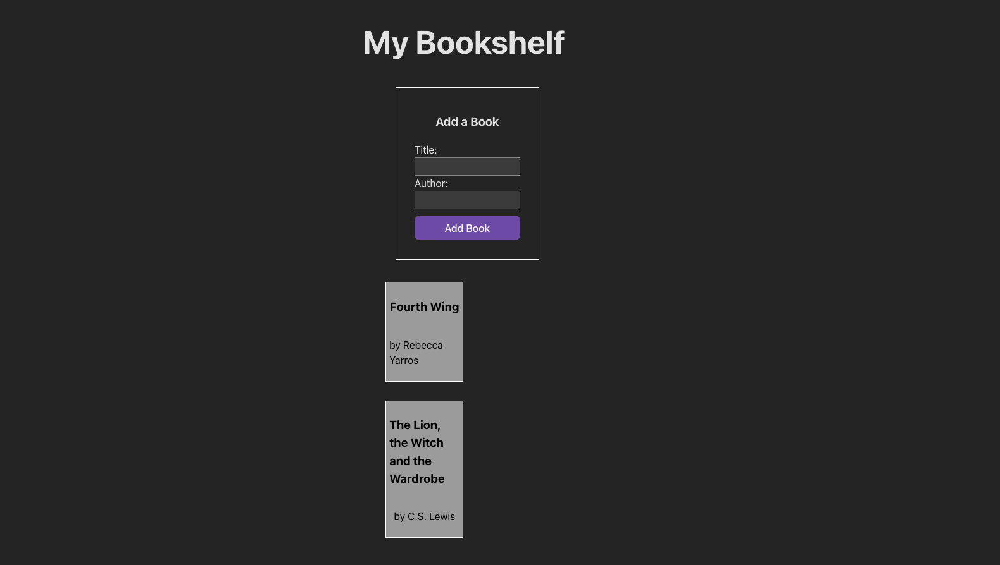

# 

Welcome to Reactville, a constantly evolving virtual metropolis. Let's build this digital town together, one component at a time.

## About

The local library is adding a feature to their website where users can add their favorite books to a virtual bookshelf. You're going to help built the front end UI to make it happen!

You will develop a single component named `BookShelf` that contains both the controlled form and the display of the bookshelf. Using the `useState` hook, you will manage the form inputs and list of books, enabling real-time updates to the UI based on user input.

By the end of this lab, you'll have a functional application where users can add books to a personalized bookshelf, with each new entry updating the display immediately—no page reloads required!

## Prerequisites

- Controlled Forms in React

## Time to complete

Estimated time to complete core lab exercise: **90 min**

## Content

- [Setup](./setup/README.md)
- [Exercise](./exercise/README.md)

## Solution

- [Solution code](../../sandboxes/10-controlled-forms-in-react-lab-solution/README.md)
