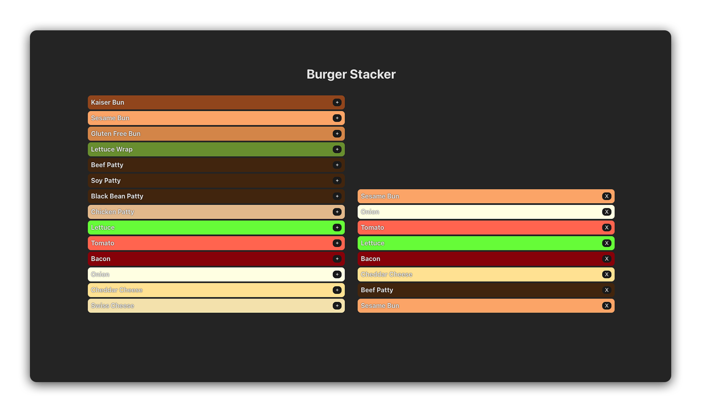
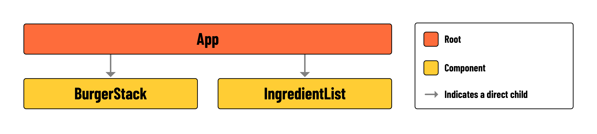

# 

## Introduction

Before diving into the exercise, take a moment to inspect the code provided to you during setup. You'll find code for two new components and a complete CSS stylesheet. Your primary focus will be on using React to execute the user stories below, reinforcing the concept of **lifting state**.

## What You'll Build



In this lab, you'll be building a burger stacker application. The interface will be divided into two main areas. On one side, you'll have a list of ingredients. Users can select from these ingredients, and upon selection, these items will move to the other side of the screen. This second area is where the user's burger is visually constructed. As ingredients are added, they'll appear stacked in the order they were selected, forming a burger.

Below is a component hierarchy diagram to illustrate how the application will be structured:



- **App**: The parent component containing `<BurgerStack>` and `<IngredientList>`. It will also contain `stack` state, and two functions for manipulating that state.
- **BurgerStack**: A `<ul>` that renders the elements held in `stack`. Each ingredient rendered in this component should contain a button for **removing** the ingredient from the `stack`.
- **IngredientList**: A `<ul>` that renders the elements held in `availableIngredients`. Each ingredient rendered in this component should contain a button for **adding** the ingredient to the `stack`.

> 🏆 Pay special attention to the `availableIngredients` array held in `src/App.jsx`. You'll likely begin by rendering this data.

## User stories

Here are the user stories for this lab:

> As a user, I want to be able to see a list of the ingredients that can be added to my burger on the left side of the screen.

> As a user, I want to be able to see a stack of the ingredients that make up my burger on the right side of the screen.

> As a user, I want to click a '+' button on an ingredient to `add it` to my burger stack. This action will place the ingredient on the stack displayed on the right side of the screen, while keeping the original ingredient list on the left unchanged.

> As a user, I want to click an 'X' button on an ingredient in my burger stack to `remove it`. This will take the ingredient off the stack on the right side of the screen, without changing the ingredient list on the left.

## Lab Exercise

Your primary goal is to implement the user stories listed above. To get started, follow the steps below:

1. In `src/App.jsx`, import `src/components/IngredientList.jsx` and `src/components/BurgerStack.jsx` and add them to the provided `<section>`.

```jsx
const App = () => {
  return (
    <main>
      <h1>Burger Stacker</h1>
      <section>
        <IngredientList />  // add here! 
        <BurgerStack />
      </section>
    </main>
  );
};
```

2. Initialize a new `useState` variable titled `stack` in `src/App.jsx`.

3. Reference the provided user stories to build out the remaining functionality of this application.

### Hints

1. There should be two child components in `src/App.jsx`. One will be responsible for rendering elements in `availableIngredients`, and the other for elements in `stack`.

2. Your application will require two functions in `src/App.jsx`. One called `addToBurger` and another called `removeFromBurger`. Think carefully about what arguments might need to be passed in to each function.

3. Notice the properties of each object held in `availableIngredients`. The `color` property can be applied to elements with *inline styling*, as shown in the example below:

  ```jsx
      <li style={{ backgroundColor: ingredient.color }}>
        {ingredient.name}
      </li>
  ```

> 📚 *Inline styling* in React involves applying CSS styles directly to elements using the `style` attribute. The attribute accepts an object with camelCased properties as its value.

## Level up

1. Create a component called `Ingredient` that can be reused by both `src/components/IngredientList.jsx` and `src/components/BurgerStack.jsx`. It should display the `name` of a single ingredient, and conditionally render the add or remove button based on its parent.

2. Apply conditional rendering within `src/components/BurgerStack.jsx`, so that a message of 'No Ingredients' is displayed if there are no ingredients in the `stack`.
