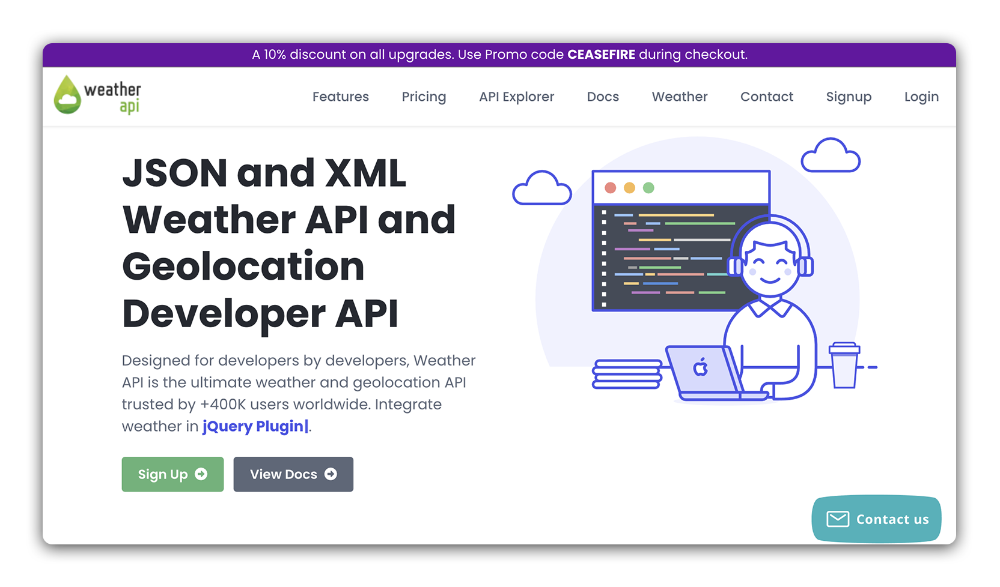
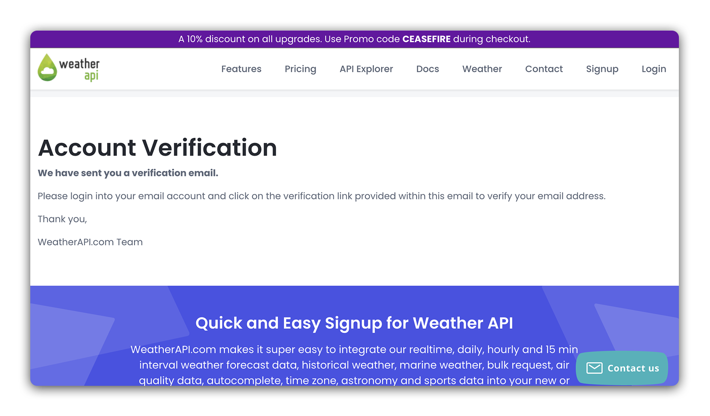
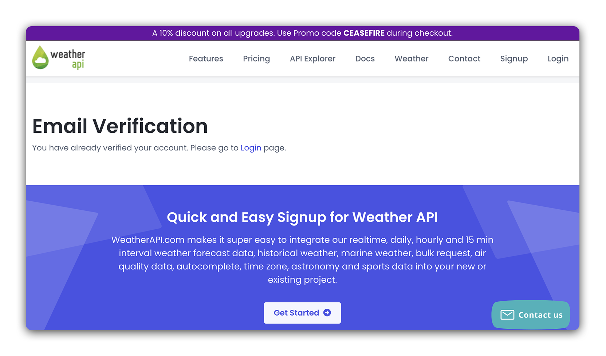
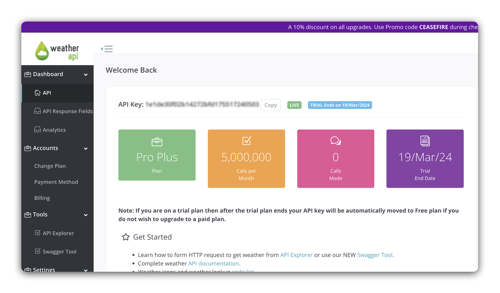
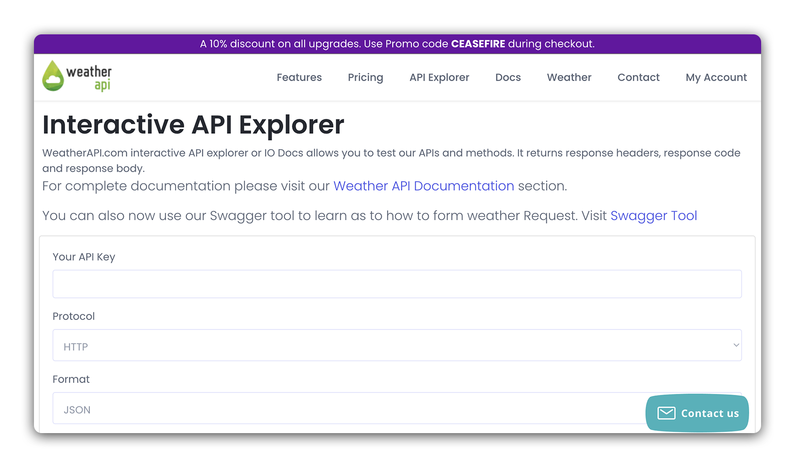
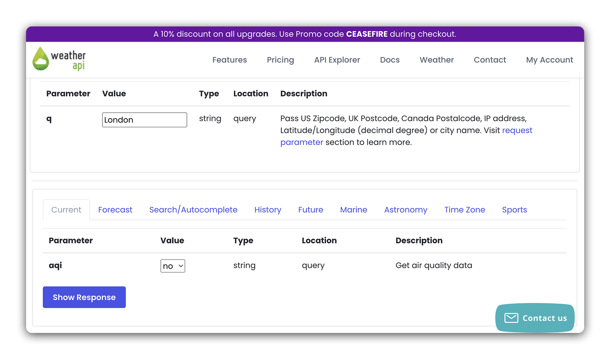
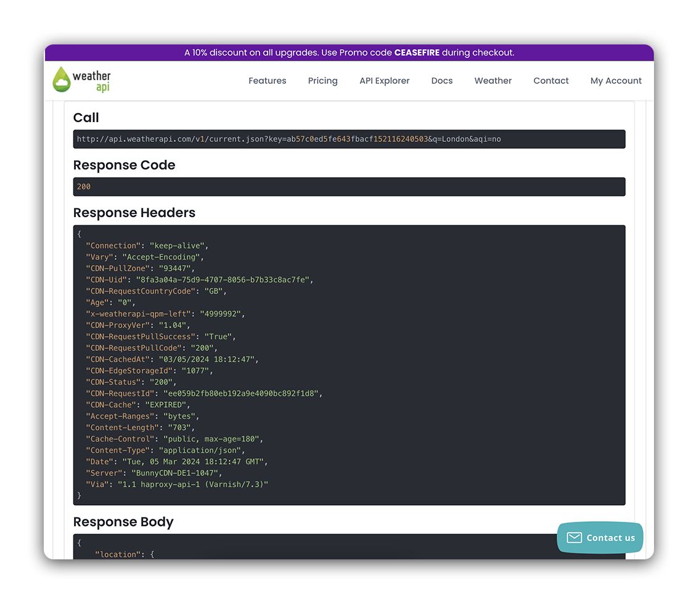

# 

**Learning objective:** By the end of this lesson, students will be able access an API Key from weatherapi.com.

## Signing up

In this lecture, we'll utilize the [Weather API](https://www.weatherapi.com/) to make fetch requests in React. The Weather API is a resource for accessing weather and geolocation data. The Weather API is free, but requires an account and API Key. Let's walk through the setup now and gain access to our API Key.

To begin, click [here](https://www.weatherapi.com/) to navigate to the Weather API landing page.

On the landing page, click on the Sign Up button:



You should be presented with a sign up form. 

After filling out the form, you should see the following Account Verification screen:



Open the email account that you used to sign up, and follow the provided link to verify your account.

After verifying your email, you should see the following screen:



After logging in, you should be taken to a dashboard page displaying your API Key:



Copy this key and store it somewhere readily accessible. We'll need it later on in this lesson.

## Using the API Explorer

The Weather API offers a straightforward interface for testing out the API. It can be accessed by clicking [here](https://www.weatherapi.com/api-explorer.aspx). Let's use the API Explorer to see what kind of data we can expect when using this API. 

First enter your API Key in the field at the top:



Next, enter a city you wish to get weather data for:



After submitting the request, you should see a response like the one below:



There are two important pieces of information here:

1. **Call**

    Notice the value provided underneath the Call header.

    ```plaintext
    http://api.weatherapi.com/v1/current.json?key=&q=London&aqi=no
    ```

    This is actually the URL or endpoint that we are making a request to. We'll use a URL very similar to this one in our React application. Notice the components of this URL, particularly the two properties (`key` and `q`) in our query string (`?`). 

2. **Response Body**
  
    This is the data that we will be working with in React. Take a moment to familiarize yourself with the structure used here, as we have some nested objects to consider. 