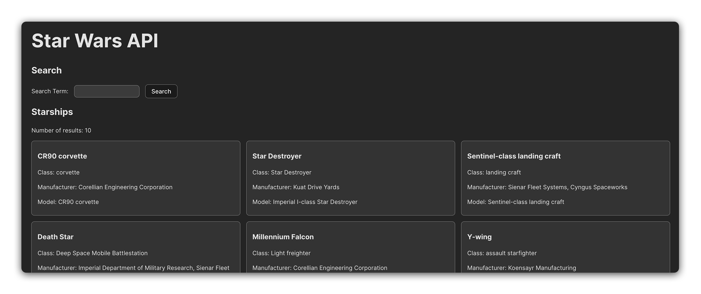
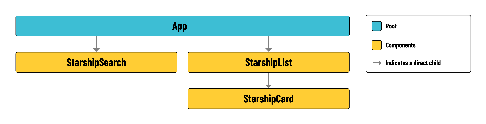

# 

## Overview



In this lab, we'll create an application that fetches and displays data from the [Star Wars API (SWAPI)](https://swapi.dev/). You'll develop a feature that presents a list of starships and allows users to search for specific starships by name. During this exercise you will practice your skills in making API calls and dynamically updating the DOM in React.

Below is a component hierarchy diagram to help you understand the structure of the application you will be building:

 

In the list below, you'll find a brief description of the role of each component in your app:

- **App**: The root component that orchestrates the entire application.
- **StarshipSearch**: Allows users to submit a search form for the name of a starship.
- **StarshipList**: Displays a list of starships held in state.
- **StarshipCard**: A component used within `StarshipList` that displays information on a single starship.

## User stories

Use the following user stories as a guide as you build each feature:

> As a user, I should see a list of starship cards when the site loads. The list should also indicate the number of results that are being displayed currently.

> As a user, I should see the `name`, `starship class`, `starship manufacturer`, and `starship model` rendered in each starship card.

> As a user, I should see a search bar above the list of starships. I should be able to enter in the name of a starship into the search bar, and submit my query.

> As a user, when I submit a search, the starship results being displayed should update based on my query.

## Lab exercise

Your primary goal is to implement the user stories listed above. Follow the steps below to get started: 

1. Research the documentation of [**SWAPI**](https://swapi.dev/documentation) to find the endpoint for the `starships` resource. Figuring out documentation is a critical skill for a developer, so devote 10-15 mins just to looking through everything. You're not going to understand it all, but you should learn a bit in the process. There is also a very helpful [home page](https://swapi.dev/) that allows you test out calls before integrating the API into your application. Practice making some calls using this tool first.

2. Create a `src/services/starshipService.js` service module and ensure that you make all API/fetch calls from this module. Use named exports to expose AJAX functionality as needed, e.g., `export { index }` or `export { search }` to obtain all starships.

3. Referencing the SWAPI documentation, create a `BASE_URL`.

4. Create a service function to retrieve a list of starships. In your service function, use your `BASE_URL` when making a `fetch()` request.

   - *Tip* : To handle data fetching effectively, incorporate error handling in your service functions. Wrap your fetch calls in try-catch blocks to manage scenarios where the API is unreachable or returns an error.

5. Create each of the components listed below.

    - `src/components/StarshipSearch.jsx`
    - `src/components/StarshipList.jsx`
    - `src/components/StarshipCard.jsx`

6. Import `StarshipSearch` and `StarshipList` at the top of `App.jsx`.  Import the `StarshipCard` component in `StarshipList.jsx`. This will be used when mapping through `props.starships`.

7. Import `useState` in `App`, and create a new `useState` variable called `starships`. Set its initial state to an empty array (`[]`).

8. Import the `useEffect` hook in `App`. Use this to call your service function when the page loads. Set the retrieved data to `starships` state. Focus on displaying the default starship results before implementing the search functionality.

9.  For the search feature, create a function in the `StarshipSearch` component that captures user input and updates a local state. You will need to lift this state up to the `App` component and then pass it as a prop to `StarshipList`. Inside StarshipList, use this prop to filter and display the relevant starships based on the search query. Be mindful of state changes and ensure your application re-renders the list when the search query is updated.

> 💡 Because data from the API is loaded asynchronously, there are times when the data may not be available to render. In this case, you may want to display a “Loading…” message instead.

## Level up

1. Once you have completed the lab, pick another resource from the ones listed on the left of the [documentation page](https://swapi.dev/documentation) (e.g. People, Species, Planets, etc...) and build a user interface implementing the same functionality as starships.

2. Add some styling to enhance the user experience of your application. Feel free to use the provided code below as a starting point:

    ```css
    /* Initial styling */

    main {
    padding: 16px 32px;
    }

    section ul {
    padding: 0;
    display: grid;
    grid-gap: 16px;
    list-style: none;
    grid-template-columns: 1fr 1fr 1fr;
    }

    li {
    padding: 8px 16px;
    border-radius: 8px;
    background-color: #333333;
    border: 1px solid rgb(160, 160, 160);
    }

    form {
    display: flex;
    align-items: center;
    }

    form * {
    margin-right: 16px;
    }

    input, button {
    padding: 8px 16px;
    border-radius: 8px;
    border: 1px solid rgb(160, 160, 160);
    }
    ```