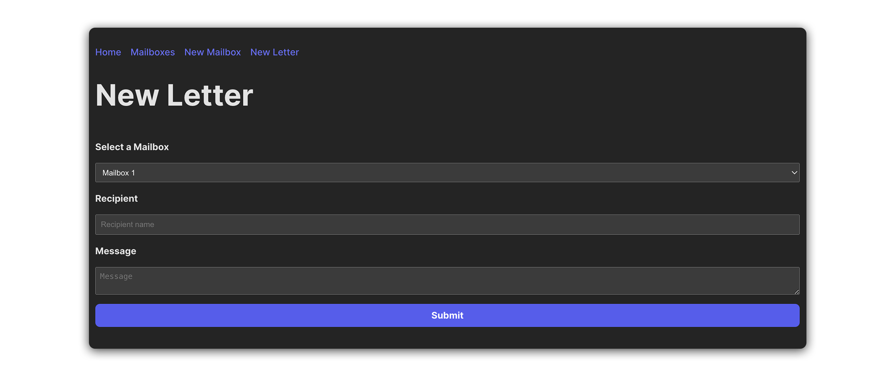
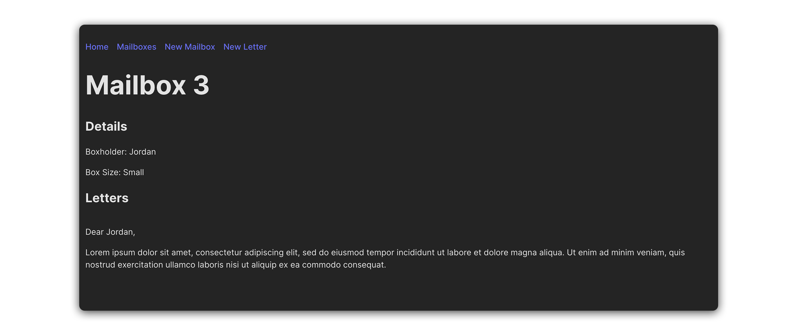

# 

## Overview

In this level up, you will add the functionality for creating and reading letters within the post office app.

Take a look at the screenshots below as reference:





## User stories

Here are the user stories to guide you through the process:

1. Create a new component called `LetterForm.jsx` and import it at the top of `src/App.jsx`.

2. In `src/App.jsx`, create a new `useState` variable called `letters`. Set its initial state to an empty array (`[]`).

3. In `src/App.jsx`, build the scaffolding for a new function called `addLetter`. It should accept form data for a new letter and `setLetters` state accordingly.

4. Implement the following user stories:

   - As a user, I want to be able to send letters to specific mailboxes.

   - As a user, I should be able to click on a 'New Letter' link in the nav bar. Doing so should navigate me to a 'New Letter' page.

   - As a user, when viewing the 'New Letter' page, I should see a `<form>` with a `<select>` menu for the box number (`_id`) that I wish to send a letter to. The `<select>` menu should have options for all existing mailboxes. The `<form>` should also have an `<input>` for the recipient name, and `<textarea>` for my message.

   - As a user, when I submit a new letter, I should be redirected to the 'MailboxDetails' page of the respective mailbox.

   - As a user, when viewing the 'MailboxDetails' page, I should see a list of all the letters that have been send to that mailbox.

### Hints

1. The `letters` `useState` variable will be used to store an array of objects, each object representing a letter. Each letter object should adhere to the shape outlined below:

```jsx
const letterExample = {
  mailboxId: 0,
  recipient: '',
  message: '',
};
```

2. To enable your users to `<select>` a mailbox when writing a letter, you will want to pass `mailboxes` state down to `src/components/LetterForm.jsx`, and use the `map()` method to generate a collection of `<option>` tags within the `<select>` menu.

3. The `useParams()` hook should be useful for displaying the `letters` of a particular mailbox in `src/components/MailboxDetails.jsx` You can use the value extracted from the URL params to `find()` a specific mailbox in `mailboxes` state.

```jsx
// src/components/MailboxDetails.jsx
const { mailboxId } = useParams();
const selectedLetters = props.letters.filter(
  (letter) => letter.mailboxId === Number(mailboxId)
);
```
