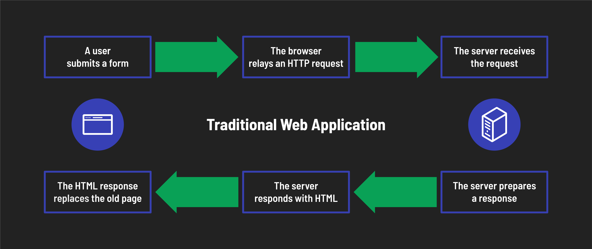
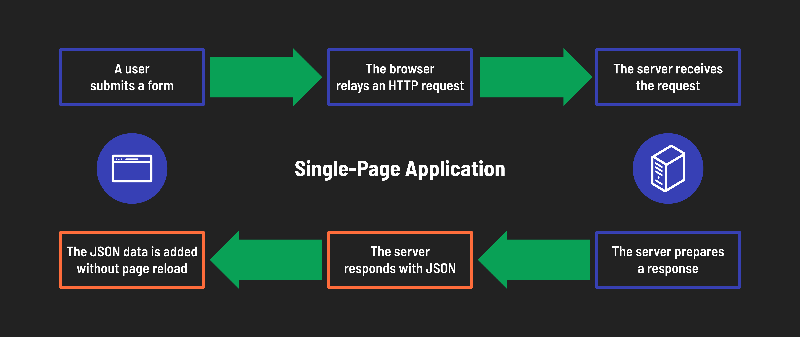
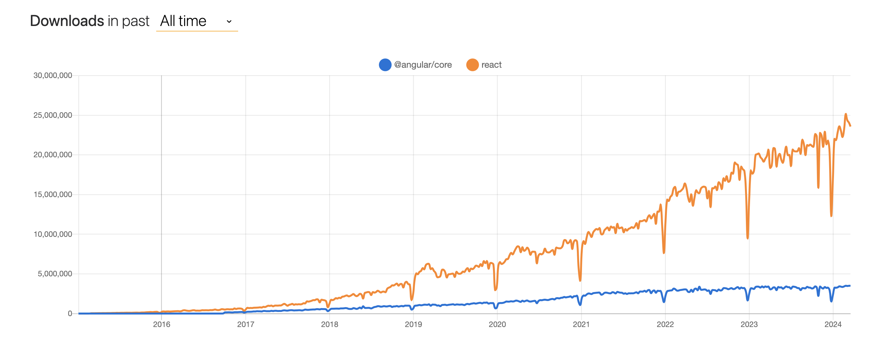

# 

**Learning objective:** By the end of this lesson, students will be able to discuss the difference between traditional web applications and single-page applications.

## What is a single-page application?

In the past, all web apps were built as MPAs or multiple-page applications. MPAs send a brand new HTML page each time a user navigates around the app. For example, when a user clicks a link or submits a form, the server responds with a new HTML page for the browser to display to the user. The old HTML page is discarded.

Single-page applications, or [SPAs](https://developer.mozilla.org/en-US/docs/Glossary/SPA), are a different approach to building web applications.

SPAs still have links and forms, but when users interact with them, the back-end server replies with raw data (often in [JSON](https://developer.mozilla.org/en-US/docs/Learn/JavaScript/Objects/JSON) format) or only the relevant HTML that needs to change. The old HTML page is retained, and changes to that page are made dynamically. All the updates are performed on the client side.

This means that the user can navigate to different parts of the application without the need to load a new page from the server.

## Why single-page applications?

SPAs have become increasingly popular in recent years. This is reflected in the chart above, which shows downloads of Angular and React - which are widely used to build SPAs. Several factors have driven this evolution:

- **User expectations**: Users want to use web apps that behave more like native desktop/mobile applications than traditional web apps. A SPA can better approximate how a native app works than an MPA can.
- **Technology advancements**: Building SPAs is easier today than it's ever been. Early SPAs were built with custom JavaScript code, but today, frameworks and libraries, such as React, Angular, and Vue.js, exist to help develop SPAs.
- **Developer experience**: Developers can often implement more advanced features more easily in SPAs than in MPAs.
- **Organization efficiencies**: SPAs enable specific teams in an organization to take ownership of smaller components of a larger application. This division of work allows for more efficient collaboration, as it requires less effort to integrate the work of multiple teams into a cohesive application. SPAs facilitate effective teamwork and remove some common pain points from app development.

## Real-world SPAs

SPAs are used in many popular websites and applications. Some examples of widely used SPAs include:

- Google Maps
- Facebook
- LinkedIn
- Netflix
- GitHub
- Amazon
- Airbnb

These examples demonstrate the wide range of applications that can benefit from using SPAs. These sites use SPAs to enhance the user experience by dynamically updating content within a single web page, eliminating the need for full-page reloads and providing a smoother, more responsive interaction with the application. This architecture aims to create a more app-like feel, improving efficiency and reducing latency in web applications.
