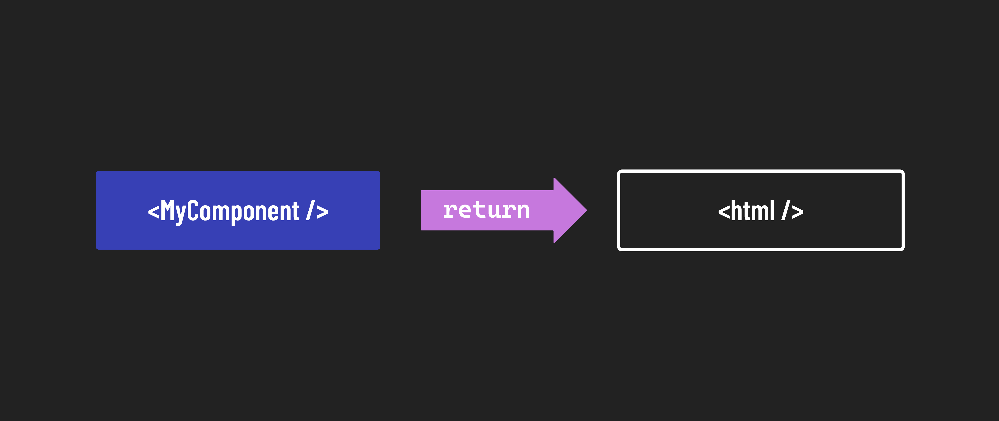
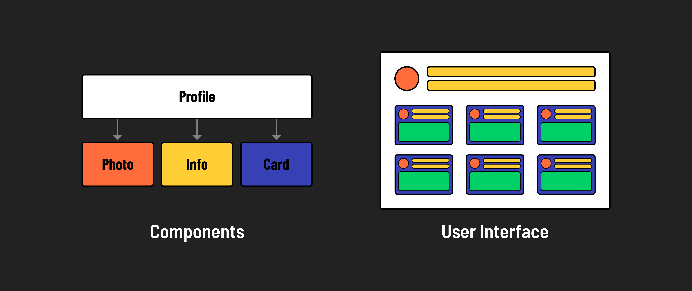

# 

**Learning objective:** By the end of this lesson, students will be introduced to the concept of modular components in React.

## UI built from components

From the [React docs](https://react.dev/learn#components):

> React apps are made out of components. A component is a piece of the UI (user interface) with its own logic and appearance. A component can be as small as a button or as large as an entire page.
>
> React components are JavaScript functions that return markup.

A core concept in React is the ability to build and reuse components throughout an entire application.

Using components in React offers several benefits, the most important of which are:

1. **Modularity**: Components allow developers to divide a UI into smaller, reusable pieces that can be independently developed and maintained. This modularity helps organize code, making it easier to manage and scale large applications.

2. **Reusability**: Components are built with reusability in mind, meaning you can create generalized components that can be shared across different parts of an application or even across different projects. This reduces code duplication and simplifies development. For example, if you wanted to display a user's profile picture in many places across an application, a component could help accomplish that.

   

3. **Maintainability**: By encapsulating functionality within components, React makes it easier to maintain and update an application. Because changes are isolated to a single component, the risk of bugs spreading through an app is reduced.
