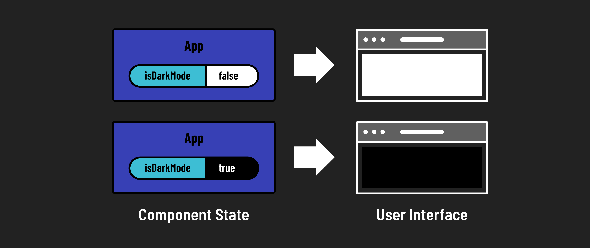

# 

**Learning objective:** By the end of this lesson, students will be introduced to the concept of state in React.

## State management

State management is a crucial aspect of React. Components will often need to remember information that will determine what is rendered to the screen in the browser. This information may change over time in response to events such as user actions. React uses ***state*** as the mechanism for this. Think of state as the present status or condition of something.

For instance, a television has state - what the volume is set to, what channel or input is being shown, or whether it is on or off - all of which would be considered state.

You can also manipulate the TV's state - for example, by hitting the volume up button on the remote. When you do this, the TV responds by increasing the volume and displaying the new volume on the screen.

React components can have state. That state can be changed in response to events - typically in response to a user action. This ability to change makes React components dynamic.

