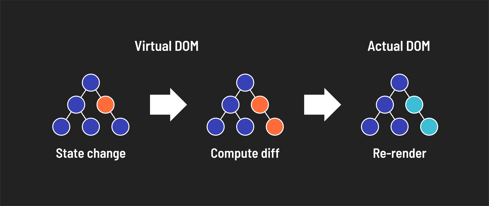

# 

**Learning objective:** By the end of this lesson, students will be able to describe how React uses a virtual DOM to make targeted updates to the UI.

## Virtual Document Object Model (virtual DOM)

When state is changed, what is shown to the user also changes. React handles these UI updates through a mechanism called the ***virtual DOM***.

The internal mechanics of the virtual DOM won't typically be relevant to you as a developer, but understanding the basics of this feature can provide helpful context in understanding why React works the way it does.

The virtual DOM starts as essentially a copy of the actual DOM. When updates are made to state, any necessary UI changes are reflected in a brand new version of the virtual DOM.

The two versions of the virtual DOM are then compared. The differences between them are calculated - this is called ***reconciliation***. The result of this reconciliation is called a ***diff***.

The actual DOM is then updated (or re-rendered) based on the calculated diff.

All of this matters to you for two reasons:

- It means you don't have to worry about how to transition your application from one state to another, significantly reducing the amount and complexity of code you have to write yourself.
- While this may seem complex and time-consuming, it is vastly more efficient than interacting directly with the actual DOM.
