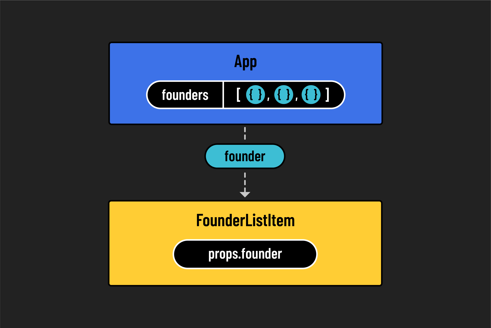

# 

**Learning objective:** By the end of this lesson, students will be able to pass data to a component inside of a `map()` array method.

## Mapping data to components



While our approach so far has demonstrated that we can reuse React components, we have to do a lot of manual work. What if we had an array of objects (an prevalent format for lists of data coming from a database), and we wanted to pass each one to a new instance of the `FounderListItem` component? This would not only make our component even more useful but also make less work for us.

Bring the below `founders` array into your `App.jsx` file.

```javascript
// src/App.jsx

const founders = [
  {
    name: "Elizabeth Holmes",
    title: "CEO",
    credential: "MBA from SuperLegit University",
    id: 1,
  },
  {
    name: "Sam Bankman-Fried",
    title: "CFO",
    credential: "CPA from TotallyReal State",
    id: 2,
  },
  {
    name: "Matt Damon",
    title: "CMO",
    credential: "Was in that movie you saw",
    id: 3,
  },
];
```

With the array of data in place, we can use the `map()` array method to transform the it into a new array of JSX elements. Note that we've added a hardcoded `id` to each object to make creating a key for each JSX element easier.

Let's refactor `App.jsx` to include a mapped list of `FounderListItem` components:

```jsx
// src/App.jsx

const App = () => {

  const founders = [
    {
      name: "Elizabeth Holmes",
      title: "CEO",
      credential: "MBA from SuperLegit University",
      id: 1,
    },
    {
      name: "Sam Bankman-Fried",
      title: "CFO",
      credential: "CPA from TotallyReal State",
      id: 2,
    },
    {
      name: "Matt Damon",
      title: "CMO",
      credential: "Was in that movie you saw",
      id: 3,
    },
  ];

  return (
    <>
      <Navbar />
      <main>
        <h1>Welcome to Hyperbo.ly</h1>
        <h2>The future is firmly in front of us!</h2>
        <p>If you can't explain it to a fifth-grader, our product does it.</p>
      </main>
      <h2>Our Founders</h2>
      <ul>
        {founders.map((founder) => (
          <FounderListItem
            key={founder.id}
            name={founder.name}
            title={founder.title}
          />
        ))}
      </ul>
    </>
  );
};
```

> ⚠️ When we use the `.map()` method in React to create a list of components, like our `FounderListItem` components, giving each one a unique `key` prop is essential. This `key` helps React track each item in the list. Specifically, it's used to identify which items have changed, been added, or been removed. This is crucial, especially when dealing with dynamic lists that might get updated or reordered.

We should now see our founders rendered to the page dynamically from our array. Great work!

## Consolidating our `props`

Currently, we are passing two of the properties down individually from each `founder` object in `App` as `props` to each `FounderListItem` component. This is a manageable number, but imagine if there were 20 or more. How would this scale?

Our list of `props` passed to `FounderListItem` would soon become unmanageably large in our JSX.

```jsx
<FounderListItem
  key={founder.id}
  name={founder.name}
  title={founder.title}
  credential={founder.credential}
  // probably many more!
/>
```

Let's refactor our `.map()` function for a more scalable `prop` structure:

```jsx
// src/App.jsx

  return (
    <>
      <Navbar />
      <main>
        <h1>Welcome to Hyperbo.ly</h1>
        <h2>The future is firmly in front of us!</h2>
        <p>If you can't explain it to a fifth-grader, our product does it.</p>
      </main>
      <h2>Our Founders</h2>
      <ul>
        {founders.map((founder) => (
          <FounderListItem key={founder.id} founder={founder} />
        ))}
      </ul>
    </>
  );
```

This requires one more change to the `FounderListItem` component because it is no longer receiving `name` or `title` props - instead, both of those properties are on the `founder` object being passed as a prop.

```jsx
// src/components/FounderListItem/FounderListItem.jsx

const FounderListItem = (props) => {
  return (
    <li>
      <h3>Hello, I'm {props.founder.name} the {props.founder.title}!</h3>
    </li>
  );
};

export default FounderListItem;
```

Much better!

### 🎓 You Do

Add a `<p>` element inside the `<li>` element after the `<h3>`. Print the credentials of each founder inside of it.
