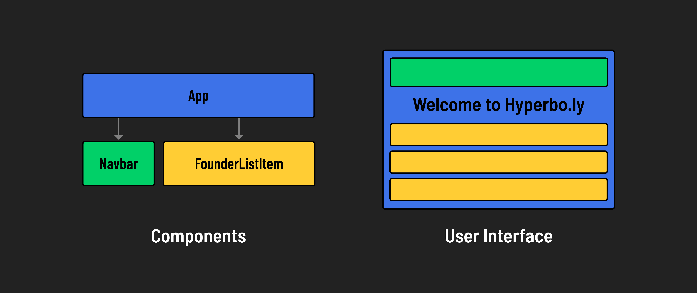
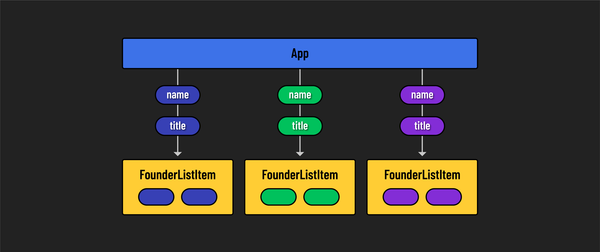

# 

**Learning objective:** By the end of this lesson, learners will be able to understand the basic concepts of component reuse in React.

## Reusability in React

We've seen the ***modularity*** of React components. But there's another impressive feature in React's toolkit: ***reusability***. Let's explore how to reuse a single component for multiple items in a list.

### The list of founders

Inside the `<ul>` in the App component, there are a series of founders - each with a name, title, and description. You might consider turning each founder's details into a separate React component, but imagine the hassle of creating a distinct file for each founder, especially when the list might change or expand.

A more efficient approach is to create a single flexible and reusable React component that can represent any founder in the list. Picture it as a template that shapes itself according to the data it receives.



## Reusing the `FounderListItem` component

Imagine if we want to pass information about each founder from our main `App` component to a `FounderListItem` component. We would use `props` to send each founder's details down the component tree.

So, in our case, each `FounderListItem` would receive its own set of props (like `name` and `title`) from the `App` component. Each instance of the `FounderListItem` component can only use the props it received to render the founder's details as specified.



Replace the last two list items in the JSX with the existing `FounderListItem` component.

```jsx
// src/App.jsx

const App = () => {
  return (
    <>
      <Navbar />
      <main>
        <h1>Welcome to Hyperbo.ly</h1>
        <h2>The future is firmly in front of us!</h2>
        <p>If you can't explain it to a fifth-grader, our product does it.</p>
      </main>
      <h2>Our Founders</h2>
      <ul>
        <FounderListItem name="Elizabeth Holmes" title="CEO"/>
        <FounderListItem />
        <FounderListItem />
      </ul>
    </>
  );
};
```

Notice how modular our `App` component markup is starting to look!

If you go to this page in the browser now, you'll see the following:

- **Hello, I'm Elizabeth Holmes, the CEO!**
- **Hello, I'm , the !**
- **Hello, I'm , the !**

***The functionality of the `FounderListItem` component depends upon the data being passed to it.*** Without the necessary data, the component can't do its job.

## 🎓 You Do

Pass data to the second and third `FounderListItem` components so that they display the correct information.

The second list item should output: **Hello, I'm Sam Bankman-Fried, the CFO!**

The third list item should output: **Hello, I'm Matt Damon, the CMO!**
