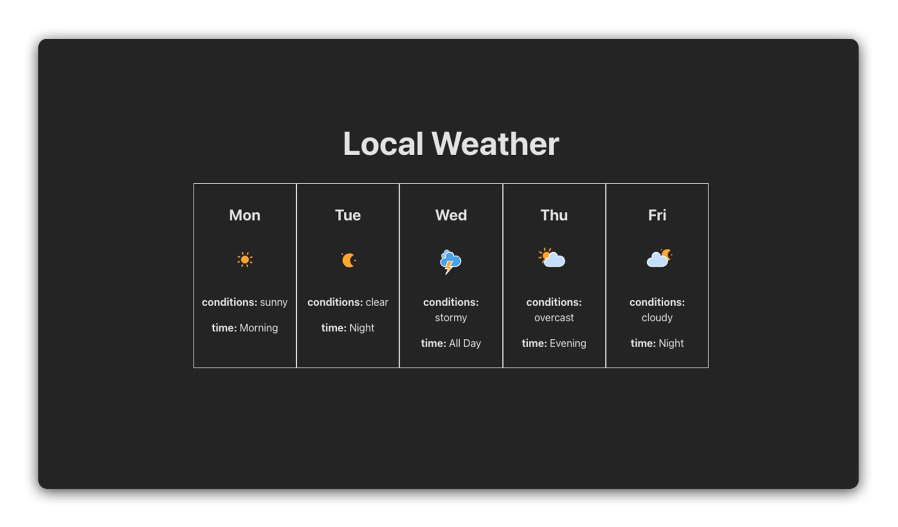

# 

Welcome to Reactville, a constantly evolving virtual metropolis. Let's build this digital town together, one component at a time.

## About

Reactville Weather Station is at the heart of the town, keeping everyone informed about the ever-changing weather. They're in need of a tech upgrade and have called on you to develop their new 5-Day Weather Forecast App.

In this lab, you will create a user-friendly React application that displays a 5-day weather forecast. Your challenge is to implement a dynamic, component-based structure where you will practice the core concept of passing data using props in React.

## Prerequisites

- React Components

## Time to complete

Estimated time to complete core lab exercise: **60 min**

## Content

- [Setup](./setup/README.md)
- [Exercise](./exercise/README.md)

## Solution code

[`/sandboxes/6-react-components-lab-solution/`](../../sandboxes/6-react-components-lab-solution/README.md)
