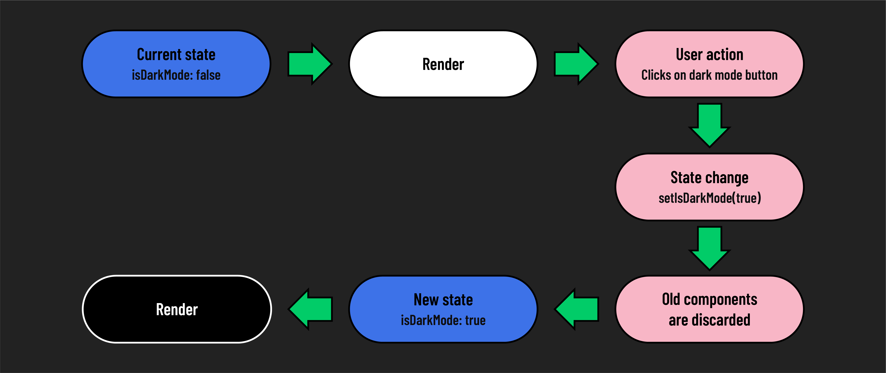
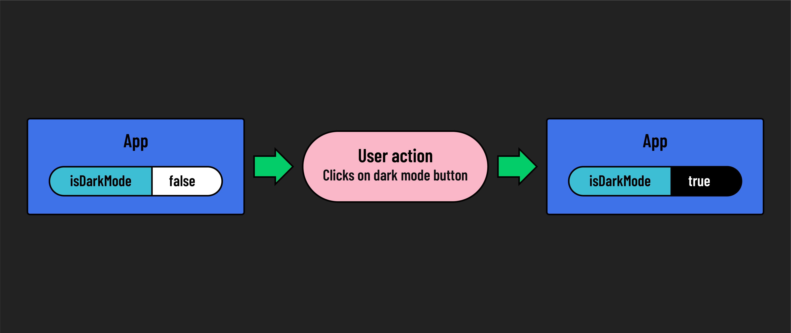

# 

**Learning objective:** By the end of this lesson, students will be able to update state using a setter function in a React component.

## Updating state

In the last lesson, we created two buttons and attached `onClick` event handlers to them. This allowed us to show a message in the console indicating we toggled between the light and dark modes. However, we didn't actually change the state of our component. Let's do that now!

Adjust the hander functions to finally make use of the setter function `setIsDarkMode`:

```jsx
  const handleDarkMode = () => {
    console.log('Dark Mode!');
    setIsDarkMode(true);
  };

  const handleLightMode = () => {
    console.log('Light Mode!');
    setIsDarkMode(false);
  };
```

When the user clicks the **Dark Mode** button, the setter function `setIsDarkMode(true)` is called, changing the `class` on the first `<div>` to `dark`.

Conversely, clicking the **Light Mode** button, the setter function `setIsDarkMode(false)` is called. This will change the `class` on the first `<div>` to `light`.

When state changes, the component (and its UI) in which that state changed is discarded, along with all of its children. All information not held in state (or by other hooks) is discarded. The new state is put into place, and data derived from state is recomputed. The UI for the component (and its children) is re-rendered, reflecting the changes that have been made to state.



> 🧠 While all of this happens very quickly, it is ***not instantaneous***. It takes time for the setter function to do its work and actually change the state. Your changes will not take effect until the component is re-rendered.
>
> The good news is that React takes care of this for you. After a setter function like `setIsDarkMode()` runs, React queues up a re-render, ensuring your UI mirrors the state changes without you having to intervene.

This behavior can be a potential pitfall as you learn to manage state. Since React does its best to remove the complexity of state changes, the rules aren't as visible, but they're still there. A good example of this is that you can't expect to be able to use the updated value of a state variable in a handler function. Take this code for example:

```jsx
  const handleDarkMode = () => {
    console.log('Dark Mode!');
    setIsDarkMode(true);
    console.log(isDarkMode);
    // prints the value of isDarkMode before handleDarkMode is called
    // try clicking the Light Mode button before clicking the Dark Mode
    // button you'll see a false value logged to the console.
  };
```

As you work with state more, these quirks and complexities will become more natural, but it's not uncommon to stumble a little along the way. The React docs have three excellent pages on the rules of working with state that you should refer back to when you need to dive deeper into those complexities to solve a problem:

- [Render and Commit](https://react.dev/learn/render-and-commit)
- [State as a Snapshot](https://react.dev/learn/state-as-a-snapshot)
- [Queueing a Series of State Updates](https://react.dev/learn/queueing-a-series-of-state-updates)

## State is immutable

Recall that state in React is immutable and should never be changed directly. An example of attempting to mutate state directly might look something like this:

```jsx
// ! Don't do this!!
  const handleDarkMode = () => {
    console.log('Dark Mode!');
    isDarkMode = true;
  };
```

React only knows to re-render after a setter function is called. When state is directly changed, React is left in the dark, which causes state to de-sync from the UI.

## Using state



After updating our handler function, we should now be able to use our buttons to change the state of our application from light to dark mode.

```jsx
// src/App.js

import { useState } from 'react';
import './App.css';

const App = () => {
  const [isDarkMode, setIsDarkMode] = useState(false);

  const handleDarkMode = () => {
    console.log('Dark Mode!');
    setIsDarkMode(true);
  };

  const handleLightMode = () => {
    console.log('Light Mode!');
    setIsDarkMode(false);
  };

  return (
    <>
      <div className={isDarkMode ? 'dark' : 'light'}>
        <h1>Hello world!</h1>
      </div>
      <div>
        <button onClick={handleDarkMode}>Dark Mode</button>
        <button onClick={handleLightMode}>Light Mode</button>
      </div>
    </>
  );
};

export default App;
```

Great work!
