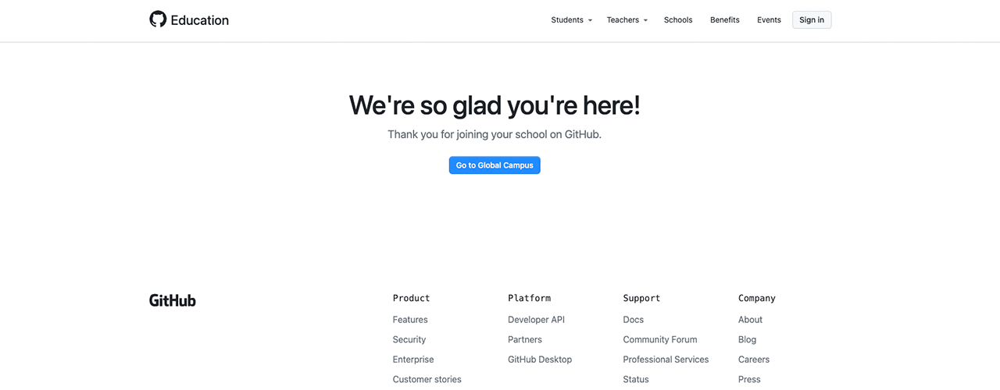
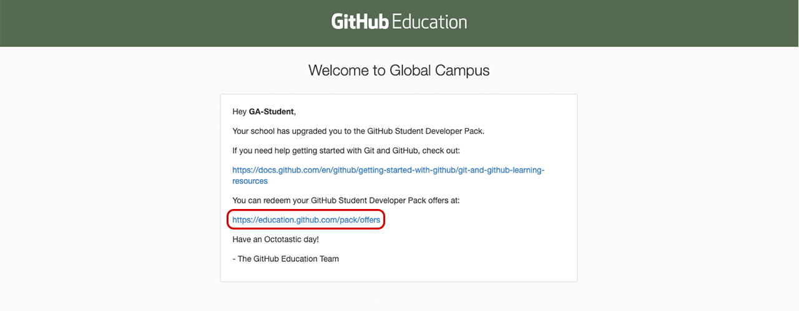
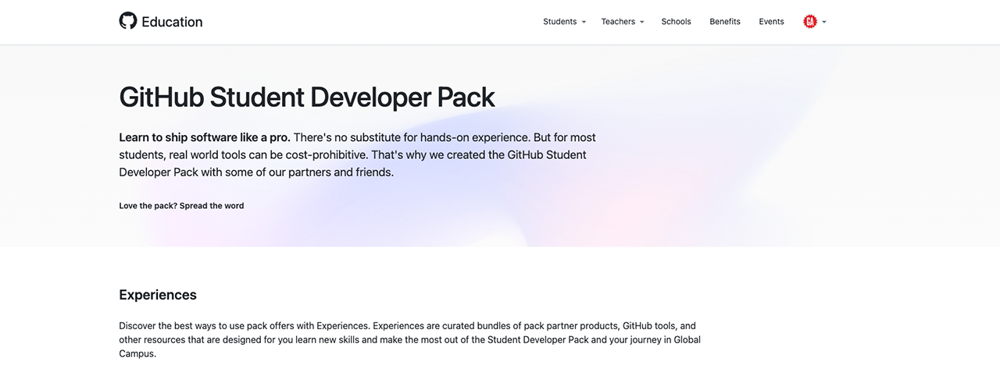

# 

## Step 1: Log in to GitHub

In your browser, if not logged in already, log into [GitHub](https://github.com/) (not GitHub Enterprise) using your personal GitHub account.

By now you'll have received a unique URL that starts with `https://education.github.com/student/` Navigate to the full URL you were given and you'll see a page like this:

> ❗ ***DO NOT CLICK ON ANYTHING!*** There is no need to click the **Go to Global Campus** button. By simply entering the URL in your browser you received access to the Student Developer pack immediately.

## Step 2: Check your email

Go to the email account associated with your personal GitHub account and look for an email from `edu-noreply@github.com`. Upon opening the email you should see this message:

Click the link as shown in the image above, or navigate to [https://education.github.com/pack/offers](https://education.github.com/pack/offers).

## Step 3: Access your student developer pack

You should now see a page that looks like this:

Go ahead and check out all the awesome offers provided to you via GitHub Campus! 🎉

