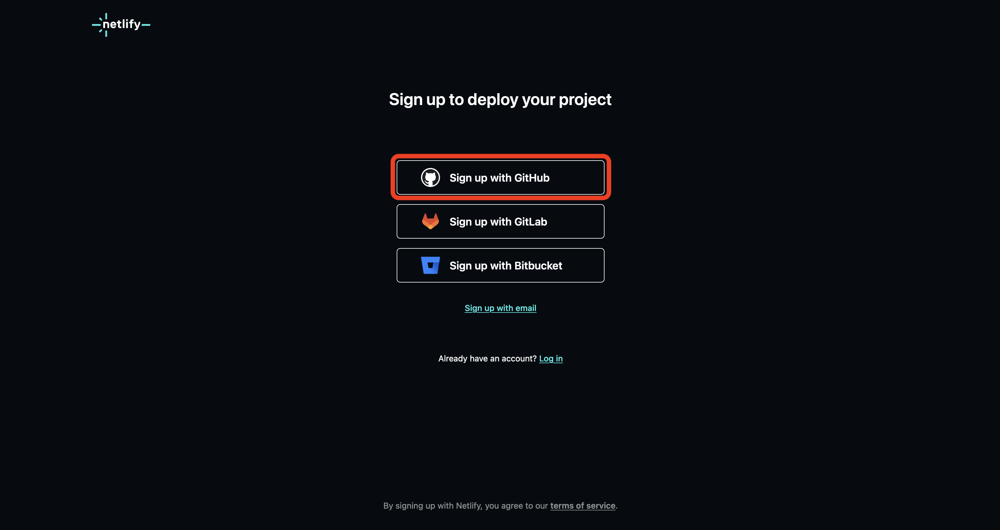
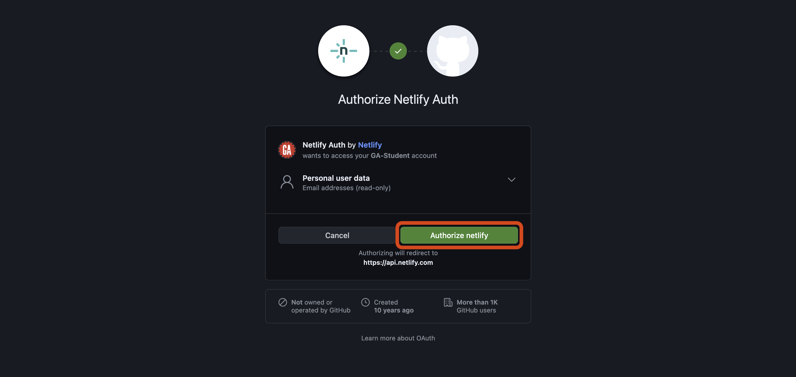
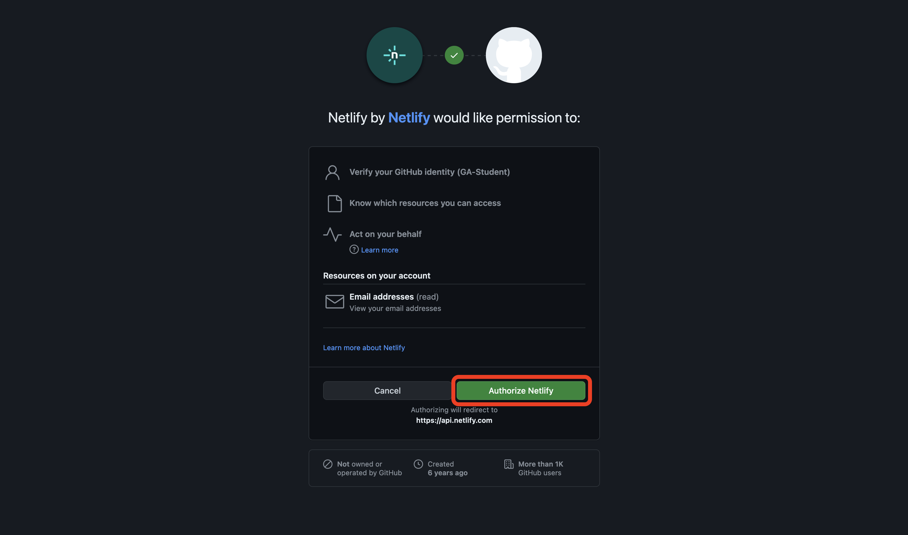
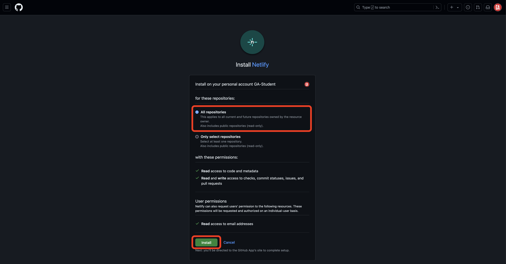
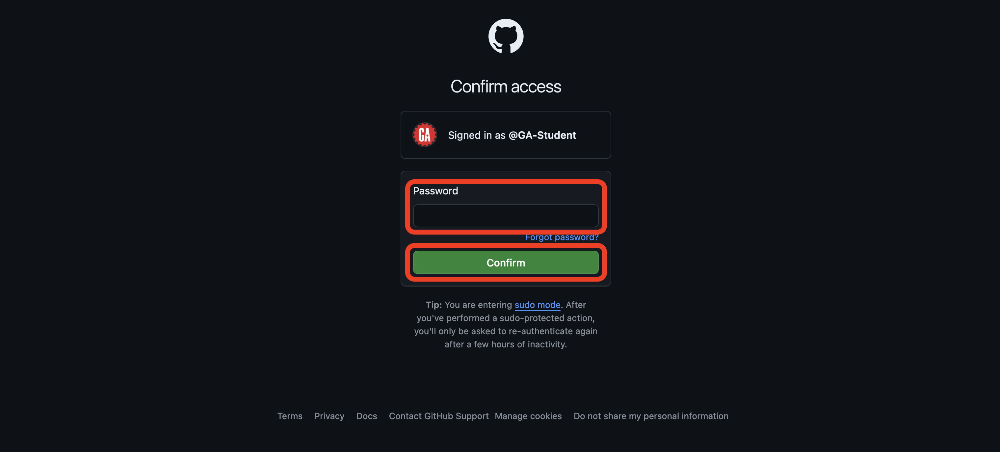

# 

## Intro

Netlify is a service that lets developers build and deploy sites from a Git repository. It does not support back-end applications (excluding serverless functions), so it's typically used to host front-end apps.

This guide will walk you through signing up for a Netlify account.

## Getting started

To begin, you must be signed into the GitHub account you want to use with Netlify.

## Sign up for Netlify

Navigate to the signup page at <https://app.netlify.com/signup>.

Select the **Sign up with GitHub** option highlighted below:

You'll be asked to select an account to authorize Netlify to use and then be prompted to authorize Netlify. Select the **Authorize netlify** button outlined in red below:

After you've authorized Netlify to access your GitHub account details, you'll be taken to a page that will ask you some signup questions.

Answer the first question (How are you planning to use Netlify?) by selecting the best option for your use case. If unsure, choose **Personal**. After that, select the **Continue to deploy** button. You don't need to answer any other questions. These are outlined in red below:

You'll be asked to deploy your first project. We don't want to do this right now, so select the **Skip this step for now** link outlined in red below.

You'll be taken to your team dashboard like the one shown below (even if you're working alone, Netlify classifies you as a team). Congrats, you've signed up for a Netlify account!

## Authorize Netlify to access your GitHub repositories

Ensure you are signed in to Netlify and navigate to the [deployment page](https://app.netlify.com/start).

Select the Deploy with GitHub option outlined in red below:

A pop-up window will appear asking you to select an account to authorize Netlify to use and then be prompted to authorize Netlify. Select the **Authorize Netlify** button outlined in red below:

You'll be taken to the Install Netlify page to add Netlify to your GitHub account. Grant access to all repositories and then select the **Install** button outlined in red below:

This is a potentially dangerous action, so GitHub requires us to provide a password or other account authentication step for this action:

Congrats! You've authorized Netlify to access your GitHub repositories and are ready to deploy apps using Netlify!
