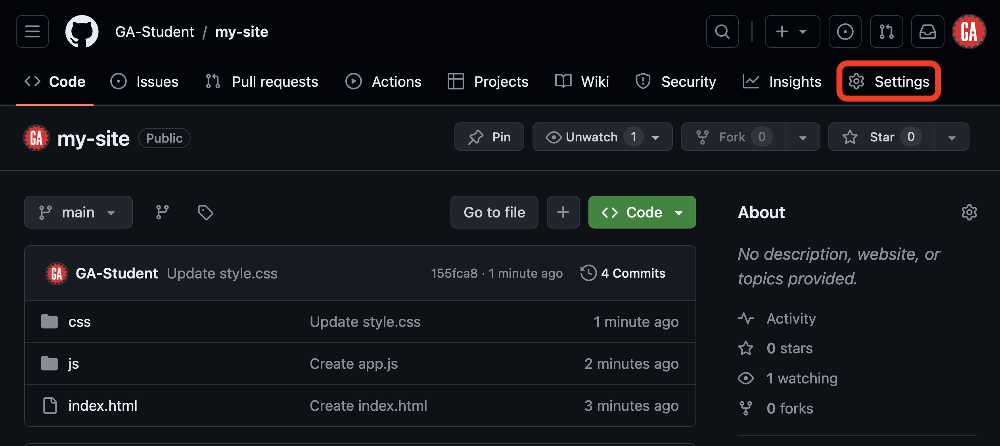
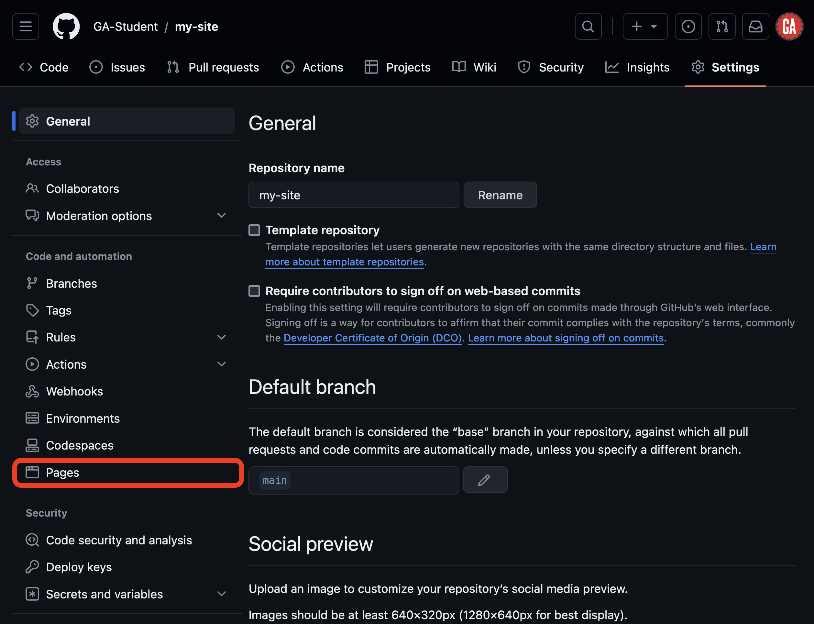
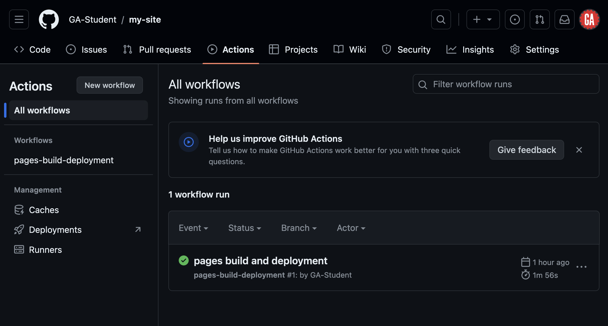

# 

## Intro

This guide will walk you through deploying a static site to GitHub Pages. Static sites are apps that consist only of fixed content (HTML, CSS, JavaScript, and static assets such as images) delivered to users exactly as it is stored.

Static sites do not require server-side processing after being built. Each webpage in the app is a separate HTML file - when a user accesses a page, the server sends the file as-is, without any modifications.

## Getting started

To begin, you'll need:

- A public GitHub repo if using a free GitHub account (GitHub Pro, Team, and Enterprise accounts can deploy private GitHub repos).
- An entry file for your site. By default GitHub Pages will look for an `index.html` file at the root of your application as the entry file.

## Deploying a site with GitHub Pages

Go to the GitHub repo for the site you would like to deploy on GitHub Pages and select **Settings** in the nav bar for the repo, as outlined in red in the screenshot below. If the window is too narrow to show this option, you'll need to click **...** before this option can be seen.

Note the `index.html` file in the root of this repository.

After navigating to the **Settings** option, select the **Pages** option in the side navigation bar, as shown in the screenshot below:

On the GitHub Pages view, you'll select a branch you'd like to deploy to enable GitHub Pages for this repository. First, click the dropdown labeled **None** under the **Branch** header outlined in red below. Next, select the branch you'd like to deploy. You can deploy any branch - only changes in that branch will be deployed. As shown here, we'll deploy the `main` branch outlined in red below, but any branch could be deployed.

As we noted earlier, the entry point into our application is an `index.html` file at the root of our app so we don't need to change where the site will build from (**/ (root)**). Click the **Save** button as outlined in red below.

Your changes will be saved, and the site will deploy.

Once deployed, you can find a link to the site on this same page, as shown below outlined in red. You will need to refresh the page to see this. Deploying will typically happen within five minutes but could take up to ten. If it takes longer, try pushing changes to the branch you selected to deploy the app from, and again, wait 5-10 minutes for the site to deploy.

## Updating your deployed site

Each push to the branch you are using to deploy the site on GitHub will trigger an update to the deployed site. While changes will usually be live within five minutes, it could take up to ten minutes for the deployed site to update.

## Troubleshooting

If your site has never successfully deployed, start by confirming that you are publishing the proper branch and have specified the correct directory as the entry point.

Once you've confirmed this, most errors or missing updates can be resolved by committing and pushing to the branch you used to deploy the site. Attempt this first.

If you still have errors, they can likely be diagnosed within the **Actions** page in the GitHub repo, shown in the screenshot below. Pair with an instructor to help troubleshoot.

