# 

## Intro

This guide will walk you through deploying a React application to Netlify.

## Getting started (don't skip this, this is important!)

To begin, you'll need:

- A Netlify account authorized to access your GitHub repositories. Follow the [Getting Started with Netlify](../getting-started-with-netlify/README.md) guide to walk you through this if you haven't already. You should be signed in to this account.
- A React project built with Vite.
- The React app starts and runs ***without warnings or errors***.
- Your React project is in a ***public*** GitHub repo.

## Deploying a React front-end with Netlify

> 🚨 Before you begin, ensure that your application runs without errors or warnings in the console.

### Prepare the React app to be deployed

In your React project, create a file called `_redirects` inside the `public` directory with this command:

```bash
touch public/_redirects
```

Place this text in that file:

```plaintext
/* /index.html 200
```

Adding this will ensure that when users browse to any route in your site the `index.html` file is served. This will prevent erroneous 404 errors when navigating to valid client-side routes using the browser's address bar.

Add, commit, and push these changes to GitHub.

### Connect your GitHub repo to Netlify

Ensure you are signed in to Netlify and navigate to the [deployment page](https://app.netlify.com/start).

Select the Deploy with GitHub option outlined in red below:

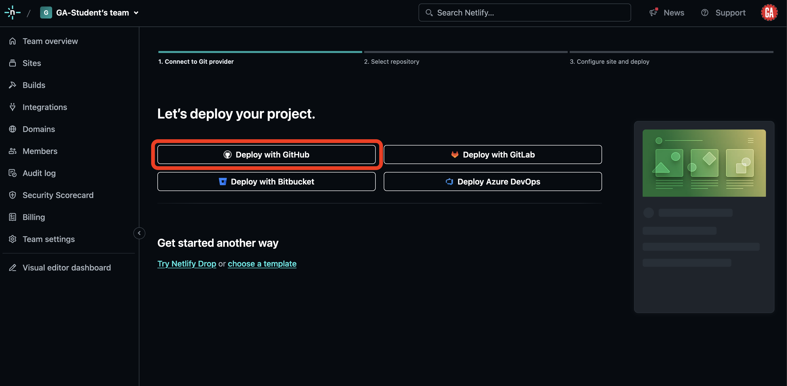

You may be asked to verify your session on GitHub. Do so.

You'll be taken to a page asking you to select a repo to deploy. Select the repo for the React application you want to deploy from the list. It will look similar to the list outlined in red below. Note the search functionality in the top right of the portion outlined in red - this will allow you to search for a specific repo on your GitHub account.

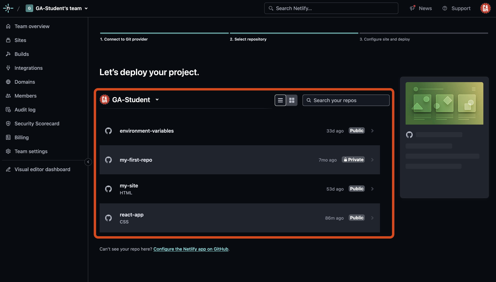

You'll configure your application on the next page.

If you'd like, you can pick a site name so that your application has a meaningful URL. If you customize this, you must confirm that the URL you'd like is available by clicking the **Check availability** button.

Next, ensure you're deploying the appropriate branch - `main` is a sensible default that will work for most apps you build, but apps using more complex branch configurations may deploy from a branch such as `prod`.

When you've completed these configuration steps, select the **deploy** button.

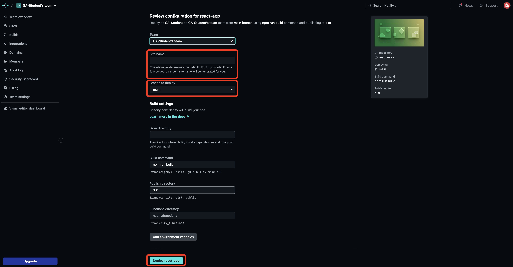

From now on, any new commits to the branch on GitHub you selected to deploy from will trigger a re-deployment of this site on Netlify.

If you're deploying a simple React front-end app, you may be done! After a few moments, your site should deploy, and you should be able to access it at `https://<your-app-name>.netlify.app/` replacing `<your-app-name>` (including the `<` and `>`) with the name of your deployed application on Netlify.

If you need to customize anything such as configuring environment variables, changing the domain name, or more, read on for details.

See the **Troubleshooting** section below if you're having difficulty accessing your site.

## Updating your deployed site

Any new commits to the branch on GitHub you selected to deploy from will trigger a re-deploy on Netlify.

## Configuration

Below are some common configuration details you may want to edit, including:

- Adding Environment variables
- Changing the site URL

### Adding environment variables

Before you begin, you'll need access to your React app's `.env`.

From your [Netlify team dashboard](https://app.netlify.com), select the site you want to configure from the sites list outlined in red below:

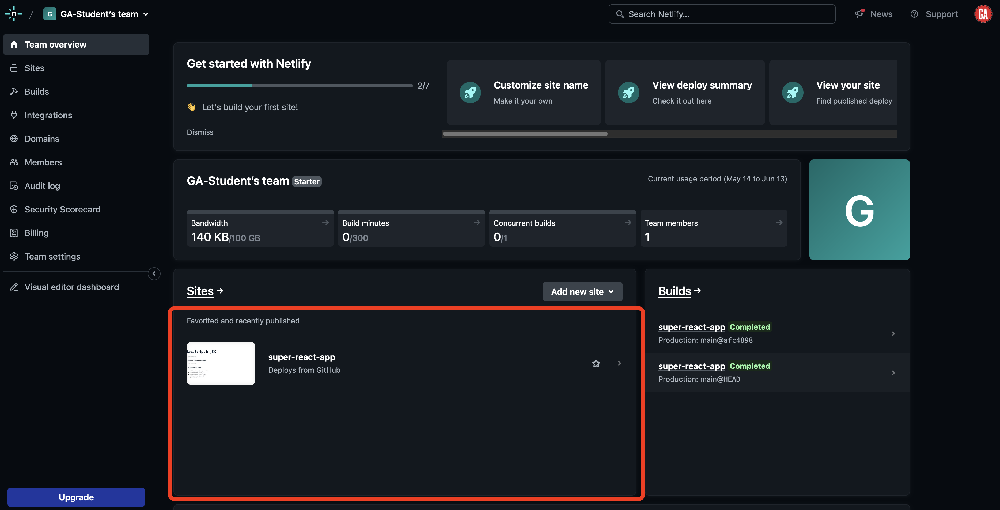

You'll be taken to the Site overview page. Select **Site configuration** outlined in red below:

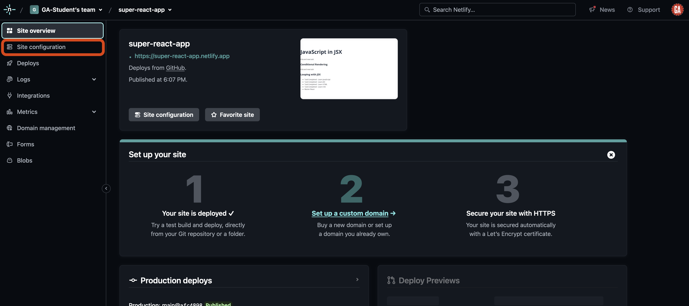

On the site configuration page, select **Environment variables** from the left sub-nav.

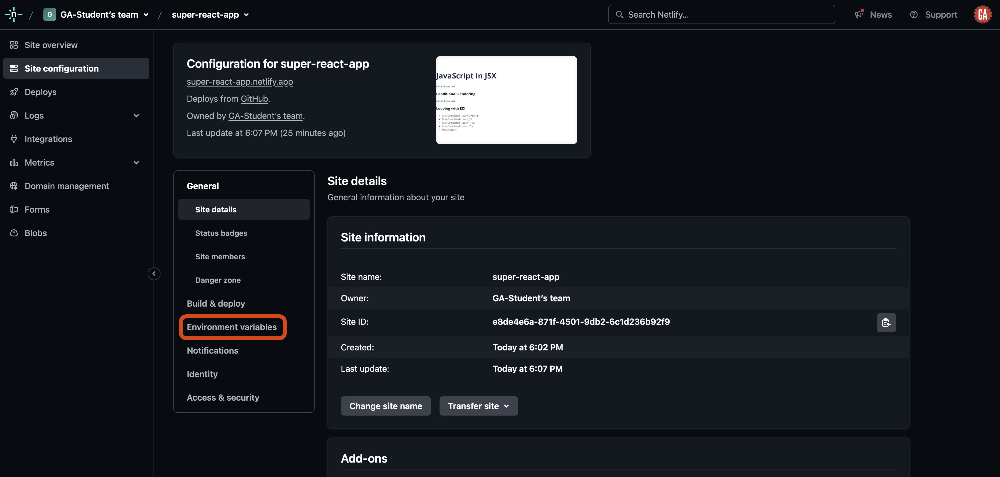

On the environment variables page, select the **Add a variable** dropdown and then the **Import from a .env file** option under it.

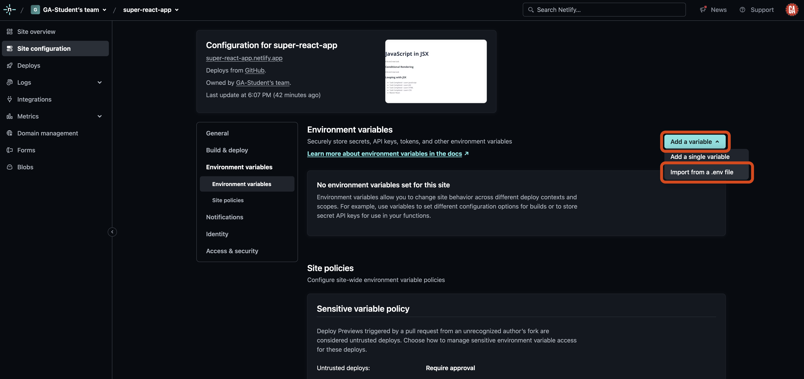

Copy the contents of your React app's `.env` file. Paste it into the **Contents of .env file** field outlined in red below.

> 🚨 Note that depending on your app configuration, you may or may not need to alter some of these values.
>
> For example, if your front-end React application is connected to a back-end API, you likely have an environment variable like `VITE_API_URL=http://localhost:3000`. This must be changed - there will not be a server app running at `http://localhost:3000` on Netlify's servers.
>
> Change this value in your deployed app to something like `VITE_API_URL=<deployed-back-end-app-url>` replacing `<deployed-back-end-app-url>` (including the `<` and `>`) with the URL to your deployed application.
>
> If the existing value doesn't end in a slash (like `http://localhost:3000` above), you'll want to ensure the URL you use here doesn't have a `/` at the end either. The same is true if this value ***does*** end in a slash - it should be uniform.
>
> Finally, you will likely want to continue developing your app using the API running locally, so you ***should not*** change this in your app's `.env` file.

After you have completed this, select the **Import variables** button outlined in red below.


These environment variables will not take effect until the next app deployment. Trigger a re-deploy of your site by navigating to your site's deploys by selecting **Deploys** from the left-side navigation as outlined in red below:

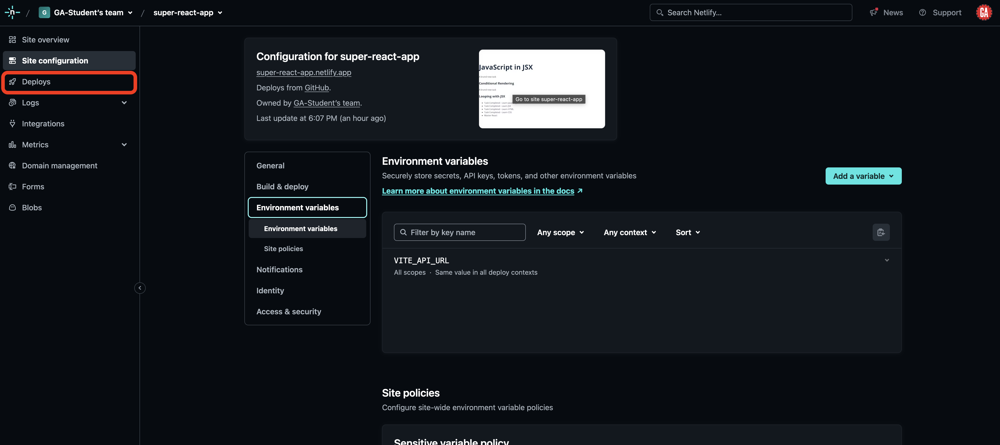

Then select the **Trigger deploy** dropdown followed by the **Clear cache and deploy site** option.

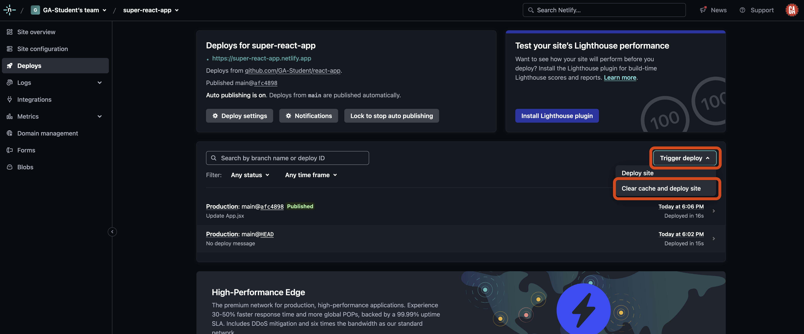

You'll be taken to the deploy log page. If all goes well, your app will deploy successfully.

### Changing the site URL

From your [Netlify team dashboard](https://app.netlify.com), select the site you want to configure from the sites list outlined in red below:


You'll be taken to the Site overview page. Select **Site configuration** outlined in red below:


You'll see details for the site, including a **Change site name** button. Select this.

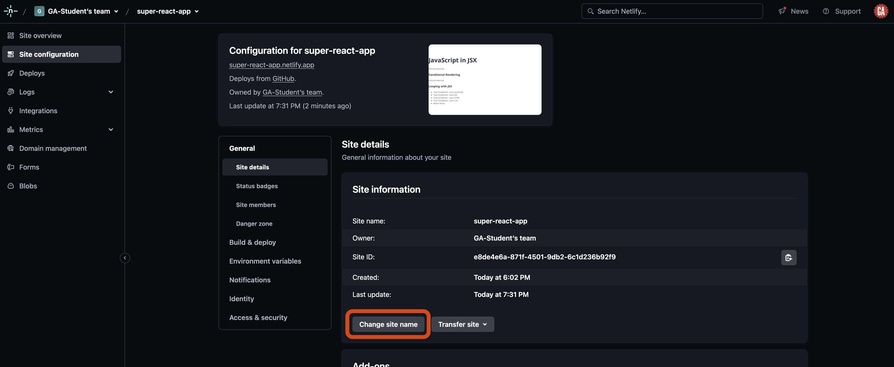

Change your site name to something appropriate for your project. Note that your desired name may be taken, so you'll probably have to get creative. After you've picked a name, select **Save**, outlined in red below.

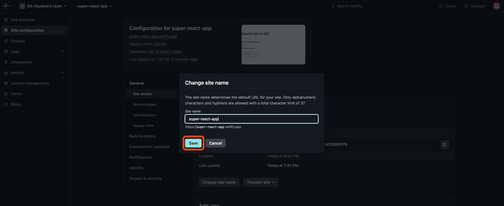

## Troubleshooting build errors

The most common error you'll encounter is when an app fails to build as it is being deployed. To view the error causing this, navigate to your most recent deployment on Netlify.

From your [Netlify team dashboard](https://app.netlify.com), select the site you want to configure from the sites list outlined in red below:


You'll be taken to the Site overview page. From here, select the most recent failed build, which will look similar to that outlined in red below:


You'll be taken to a page detailing the deployment events, including where they failed. Expand the deploy log for the relevant section by selecting it, which will look similar to that outlined in red below:

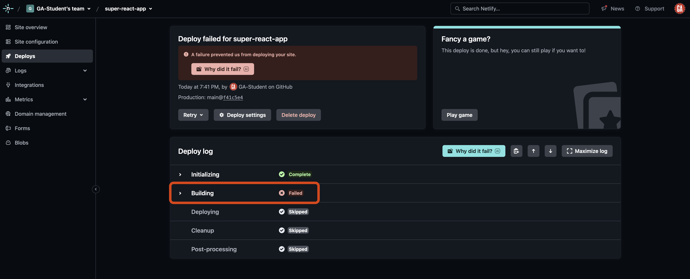

Explore the expanded log. It will provide details about why the build failed. This will likely reveal errors in your application that you must resolve (like the one in the screenshot below) before your app can successfully be deployed. The most relevant details about the error will typically be towards the top of the error message, as outlined in red below:

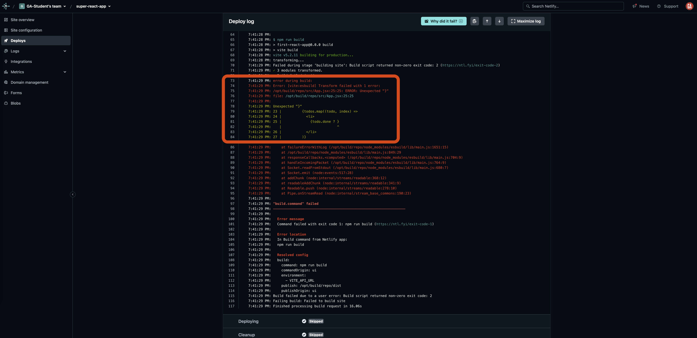

### Disable warnings triggering build failures

Builds can fail due to warning messages that would not cause a build to fail when running an application locally. While it would ultimately be better to resolve these warnings in your application, Netlify does provide an escape hatch for when this behavior is causing detrimental harm. More details on this behavior can be found [here](https://docs.netlify.com/configure-builds/troubleshooting-tips/#build-fails-on-warning-message).

This section outlines how to use this escape hatch.

From your [Netlify team dashboard](https://app.netlify.com), select the site you want to configure from the sites list outlined in red below:


You'll be taken to the Site overview page. Select **Site configuration** outlined in red below:


On the site configuration page, select **Build & Deploy** from the left sub-nav.

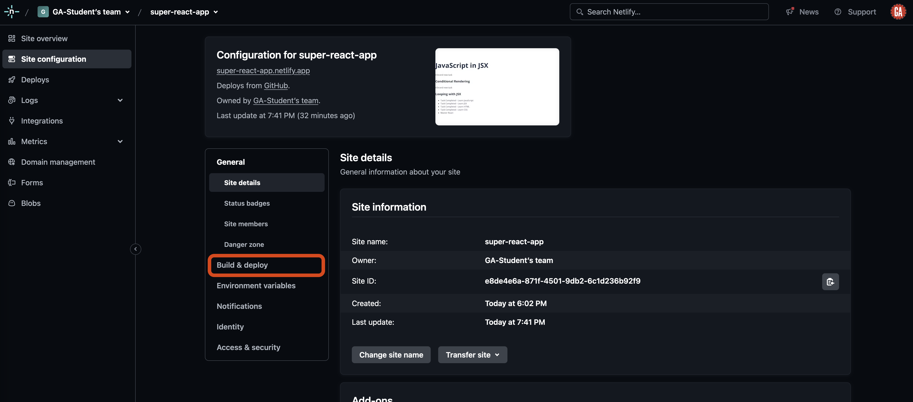

On the build & deploy page, ***scroll down*** to the **Build settings** section and select the **Configure** button.

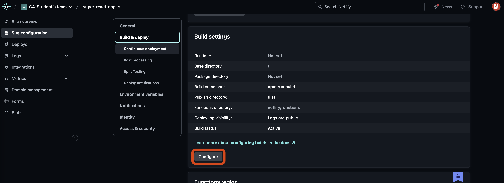

After clicking this button, you will be able to change the build settings. Change the value in the **Build command** field outlined in red below to `CI='' npm run build` (`''` is two single quote characters, not one double quote character) as shown.

After you've made this change, select the **Save** button outlined in red below.


After making this change, warnings will no longer trigger build errors in your application.
