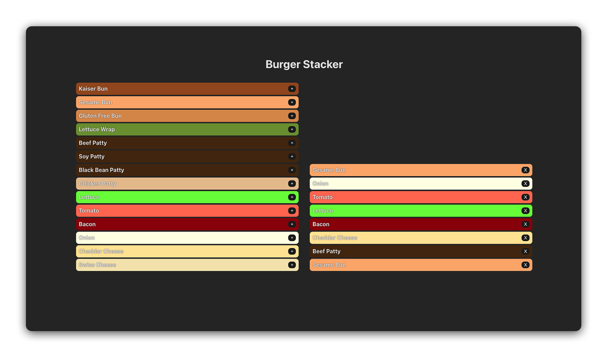

# 

## About

This repo contains the solution to the [`Lifting State in React Lab`](https://git.generalassemb.ly/modular-curriculum-all-courses/lifting-state-in-react-lab).

In this lab, students will create burger builder app that that has two main components: an ingredients list and a burger stack. Users will be able to add items from the ingredients list to the the burger stack to create the perfect burger.

## Internal resources

✏️ [Instructor Guide](./internal-resources/instructor-guide.md)

🏗️ [Release Notes](./internal-resources/release-notes.md)
