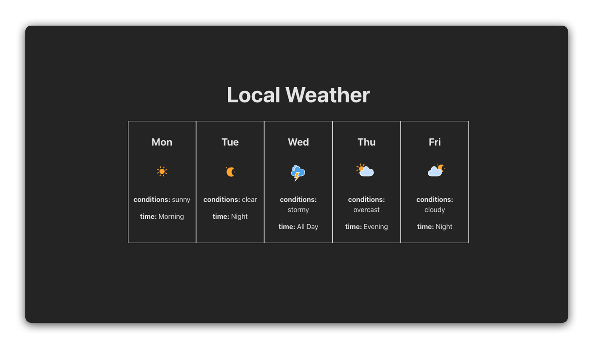

# 

# About

This repo contains solution code for the [`React Components Lab`](https://git.generalassemb.ly/modular-curriculum-all-courses/react-components-lab)

In this lab, students build a Weather Forecast React application using multiple instances of a child component that receive props from a parent component.
